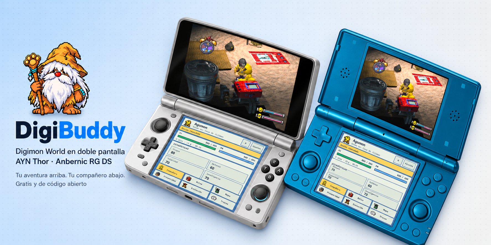
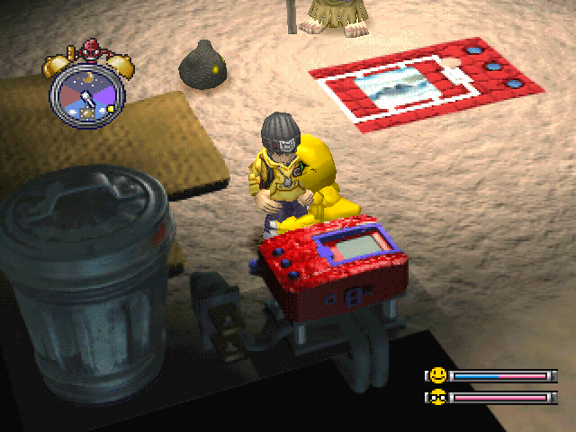
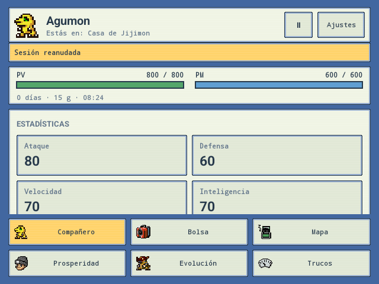
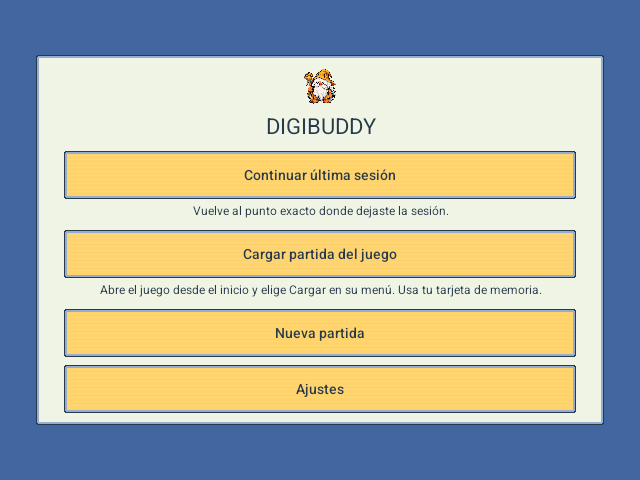

<p align="center">
  <a href="#instalación">Instalación</a> ·
  <a href="#funciones">Funciones</a> ·
  <a href="#juego-compatible">Juego compatible</a> ·
  <a href="https://github.com/bortisoftware/DigiBuddy/issues">Informar de un problema</a>
</p>

DigiBuddy es un emulador de **Digimon World de PlayStation** para consolas Android de doble pantalla. Juega en la pantalla superior y consulta tu compañero, bolsa, mapa, prosperidad y evoluciones en un panel táctil que sigue tu partida en tiempo real.

[](https://www.youtube.com/watch?v=glKcUstdL5Q)

## Capturas

Capturas reales en Anbernic RG DS.

| Pantalla superior · juego | Pantalla inferior · compañero |
| --- | --- |
|  |  |

<details>
<summary>Inicio y selección de partida</summary>



</details>

## Dispositivos

| Dispositivo | Estado |
| --- | --- |
| AYN Thor | Probado |
| Anbernic RG DS | Probado, incluidos guardar y cargar estados |

Requiere **Android 8.0 o posterior y ARM64**. Otros dispositivos de doble pantalla no se han probado.

## Instalación

Descarga la [APK de DigiBuddy 0.3.8](https://github.com/bortisoftware/DigiBuddy/releases/download/v0.3.8/DigiBuddy-0.3.8.apk) desde [Releases](https://github.com/bortisoftware/DigiBuddy/releases).

1. Instala la APK en tu consola. Si Android lo solicita, permite la instalación desde el navegador o gestor de archivos que utilices.
2. Abre DigiBuddy: el asistente te pedirá seleccionar tu BIOS de PlayStation y el juego.
3. Inicia una nueva partida o elige cargar desde el menú original del juego.

**No se incluyen BIOS ni juegos. Cada usuario debe aportar sus propios archivos.**

## Funciones

### El compañero · pantalla inferior

- **Compañero:** estadísticas, vida, energía y necesidades de tu Digimon.
- **Bolsa:** objetos e iconos; toca un objeto para confirmar su uso en el juego.
- **Mapa:** tu posición, salidas a otras zonas, WC, objetos recogibles y enemigos con retratos de frente. Toca un enemigo para consultar sus estadísticas. El color indica una estimación de dificultad. Los reclutables detectados en la zona llevan un distintivo «!» y abren su pista al tocarlos.
- **Prosperidad:** progreso del pueblo y pistas de Digimon pendientes de reclutar cerca de tu zona. Toca un retrato para ver su ubicación, pista y requisitos conocidos.
- **Evolución:** requisitos y rutas disponibles. Puedes activar una evolución válida con confirmación; deshacerla vuelve a la forma anterior con animación sin retroceder la partida.
- **Trucos:** catálogo de ocho ayudas, con confirmación antes de aplicarlas. Deshacer un truco restaura su respaldo y descarta el progreso posterior.

### El juego · pantalla superior

- Controles físicos y sonido.
- **Ajustes → Controles · Remapear botones:** toca un botón del mando PlayStation y pulsa el botón físico o dirección que quieras asignarle. Las asignaciones se guardan por mando; puedes cancelar o restaurar los controles predeterminados. El juego se pausa durante la configuración.
- Formato original **4:3** o imagen estirada para llenar la pantalla.
- Resolución interna hasta **8×**, filtros y PGXP con SwanStation OpenGL ES.
- Alternativas por software y PCSX ReARMed.

Las mejoras gráficas afectan principalmente al 3D; los fondos y vídeos conservan su detalle original. El rendimiento depende del dispositivo y los ajustes.

## Actualizaciones

DigiBuddy avisa si hay una nueva APK en las releases oficiales de GitHub. Al pulsar Actualizar, descarga y verifica la APK dentro de la app y abre el instalador de Android. La primera vez tendrás que permitir instalaciones desde DigiBuddy. Guarda tu progreso antes de instalar. También puedes comprobar manualmente en Ajustes. La consulta automática se puede desactivar; el juego funciona sin conexión.

Los ajustes de gráficos y sonido se agrupan en un desplegable. Play y Ajustes permanecen accesibles en todas las pestañas, incluido el mapa.

## Partidas y guardados

- **Continuar última sesión:** recupera el estado del emulador más reciente, si existe.
- **Cargar partida del juego:** arranca el juego normalmente para cargar desde su menú original lo guardado en la tarjeta de memoria.
- **Nueva partida:** abre el juego desde el inicio, sin borrar la tarjeta ni los estados anteriores.

Puedes guardar, cargar, importar y exportar estados desde Ajustes, además de exportar la tarjeta de memoria. Los estados importados deben corresponder al mismo juego y núcleo; se guardan como una copia adicional. Para cargar desde el menú original, recuerda guardar también dentro del propio juego.

## Juego compatible

El panel está validado para **Digimon World japonés (SLPS-01797), con el parche de traducción al español de referencia**. Otras ediciones pueden ejecutarse en el emulador, pero sus datos y las acciones del panel no están garantizados.

<details>
<summary>Cómo identificar la edición probada</summary>

SHA-256 de la imagen de disco:

```text
b5ff9ed251bced70c20eb911eab8ac3e5b77d7a140983d3b5dc31decac4837af
```

</details>

## Desarrollo y créditos

Las instrucciones de compilación están en [DESIGN.md](DESIGN.md).

**SwanStation y PCSX ReARMed:** núcleos de emulación. [Licencias](THIRD_PARTY_NOTICES.md) · [Procedencia](CORE_PROVENANCE.md).

Código propio bajo [GPL-3.0-or-later](LICENSE). Proyecto de aficionados, sin afiliación con Bandai Namco, AYN ni Anbernic.

## Nota sobre herramientas de IA

Este proyecto puede utilizar herramientas de desarrollo asistido por IA, como **Codex**, para ayudar con la generación de código, la refactorización y la documentación. Todos los cambios siguen siendo revisados por el responsable del proyecto y se validan con las comprobaciones existentes antes de cada release.
